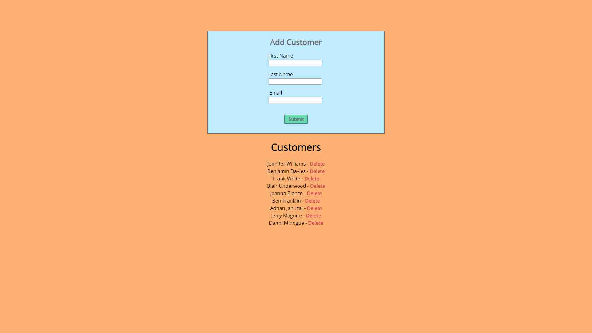

# customerapp

Basic MVC app using Node.js, Express, MongoDB, EJS, mLab &amp; Heroku built using [this](https://www.youtube.com/watch?v=gnsO8-xJ8rs) tutorial by [Brad Traversy](https://github.com/bradtraversy) 

*[Click here](https://evening-shelf-33613.herokuapp.com/) to view the project*

### Motivations
  * Get familiar the MEAN stack and how the components work together
  * Learn about new tech I was unfamiliar with
  * Observe how data is passed from server side to the front end
  * Challenge myself
  
### Design
  
  The tutorial was mainly focused on the backend, so I added some styling to the buttons and background.  

## Learning Lessons
   
 The first step was trying to understand what each part:
  * Node.js as a runtime
  * ExpressJS as server framework
  * MongoDB as a database - what is a database?
  * EJS as a templating language
